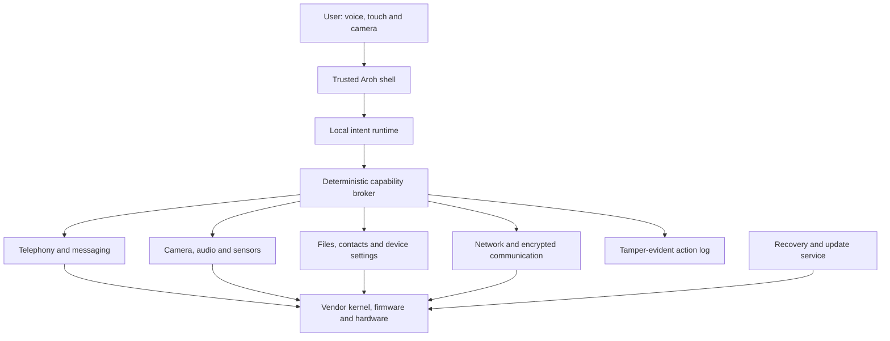

# Prototype architecture

## Boundary

Aroh V1 is an AI-native mobile userspace and trusted interaction shell running
on donor-phone hardware. The prototype can reuse the vendor kernel, boot chain,
firmware and binary hardware support where replacement is not feasible.

It must not describe that dependency as a completely independent production OS.



## Trust model

The model can interpret intent and propose a plan. It cannot directly access
hardware or private data. Every operation is expressed as a typed capability
contract and evaluated by the capability broker.

Example:

```text
intent: "Call Maya"
proposal: contacts.lookup(name="Maya") -> telephony.call(contact_id)
policy: contacts.read=allow, telephony.call=confirm_each_time
result: trusted UI asks for confirmation, then the broker executes
```

## Layers

### 1. Boot and base system

- verified, reproducible images;
- known-good recovery image;
- encrypted userdata where the device supports it;
- minimal services and attack surface; and
- hardware inventory for display, touch, modem, audio, camera, Wi-Fi and power.

### 2. Device adaptation

Each donor phone gets a manifest describing its boot flow, partitions, kernel,
firmware, available hardware paths and recovery procedure. Device-specific code
must not leak into the higher-level intent runtime.

### 3. Trusted services

Small, privilege-separated services own telephony, contacts, camera, audio,
storage, networking, updates and logging. Rust is preferred for new
memory-sensitive services; existing upstream components may use their native
languages.

### 4. Capability broker

The broker is deterministic and policy-driven. It validates typed requests,
checks identity and permission state, requests confirmation when required,
applies limits and emits an audit event.

### 5. Local intelligence

The runtime handles speech, language understanding, intent planning and limited
personalisation. V1 should prefer compact quantised models and narrow,
testable skills over a general model with unrestricted device access.

### 6. Aroh shell

The shell owns onboarding, unlock, status, consent, action review, recovery and
minimal manual controls. These surfaces must remain usable when the AI runtime
is unavailable.

## Initial technology questions

The device intake must answer these before the base is selected:

- Can the bootloader be officially unlocked?
- Is a maintained mainline or community Linux port available?
- Does the modem depend on Android vendor services?
- Can camera and audio be reached without the Android framework?
- Is `libhybris`, Halium or a limited vendor compatibility layer required?
- What recovery path survives a broken userspace image?

The answers—not ideology—determine the prototype base.
